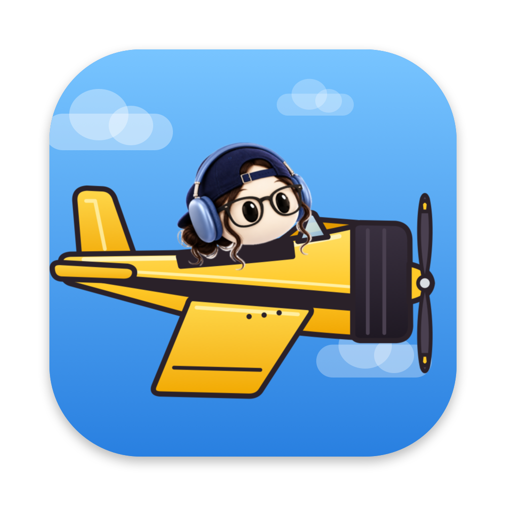

# HeadsUp



A little Mac app by Marian Gasinu: your reminders fly across the screen on a plane,
towing a banner, right when you need them.

- Add reminders with a time, a list and an optional note
- Pick a banner style (Plain, Striped, Blueprint, Sunset)
- Pick a pilot: Duck, Mia, Cat, Frog or Fox. Each has its own sound; Mia rings.
- Send a test flight anytime from the tray menu or with ⌘⇧D

Everything stays on your Mac. There's no account, server or analytics.

## Develop

```bash
npm install
npm run dev
```

## Build the app

Unsigned build for your own Mac (output: `dist/mac-arm64/HeadsUp.app`):

```bash
npm run build && npx electron-builder --mac dir --arm64 -c.mac.identity=null -c.mac.notarize=false
```

## Credits

HeadsUp is my take on [Quakpit](https://quakpit.app/), the [open-source](https://github.com/Ooble-Studio/QuakPit)
app by [Tom Boutin](https://x.com/tomboutin_) at Ooble Studio (MIT licence, see `LICENSE`). I reworked it
into a reminders app, added more pilots and banner styles, and gave it a new icon with Mia flying the plane.
